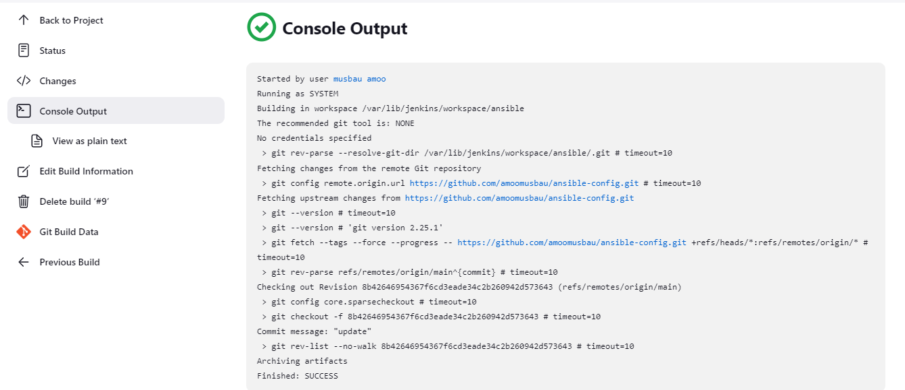

**ANSIBLE CONFIGURATION MANAGEMENT – AUTOMATE PROJECT 7 TO 10**

**Check your Ansible version by running ansible --version**

****

**Configure Webhook in GitHub and set webhook to trigger ansible build**

****

**ssh into your Jenkins-Ansible server using ssh-agent**

**using the code ssh -A ubuntu@public-ip**

****

**using git commands  to add, commit and push your branch to GitHub**

****

**Once your code changes appear in master branch – Jenkins will do its job and save all the files (build artifacts) to /var/lib/jenkins/jobs/ansible/builds/<build_number>/archive/ directory on Jenkins-Ansible server.**

****

****

**checking the status of my wireshark with the code wireshark --version**

****

